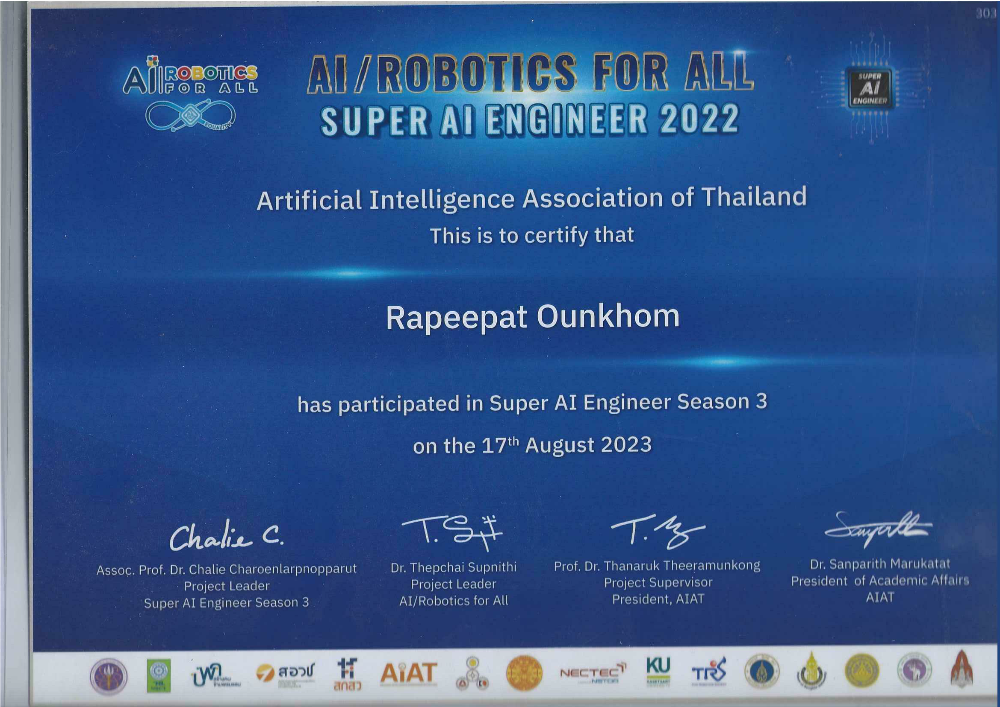

# 👋 Hi, I'm Rapeepat Ounkhom

**Bangkok, Thailand**  
📞 (202) 650-3816  
📧 [Rapeepat.Ounkhom16@gmail.com](mailto:Rapeepat.Ounkhom16@gmail.com)  
[GitHub](https://github.com/AimAim25475) • [Kaggle](https://www.kaggle.com/aimaim25475)

---

Motivated student with a strong work ethic and creative ability. I am passionate about applying my programming skills to build impactful AI models for society. My journey began with the Super AI Engineer project, which sparked my interest in Machine Learning, Deep Learning, Data Science, and Data Analysis.

---

## 🎓 Education

**Bachelor of Computer Science**  
Srinakharinwirot University, Bangkok  
_Present – 2027_

---

## 🚀 Activities

**Super AI Engineer Season 3**  
_October 2022 – Present_

- **Level 1:** Completed AI academic online course (MOOC AIAT, Fundamental Level). Participated in a Hackathon competition on Image Processing by building a CNN model for image classification.
- **Level 2:** Participated in 9-week Hackathon competitions (online & onsite) with a team of 23+ members, covering:
  - **Data Science:** Predicted poverty population ratio using open-source data (Google Earth Engine, GIS).
  - **Image Processing:** Medical image object detection (e.g., liver mass detection).
  - **IoT & Robotics:** Controlled Turtlebot3 with reinforcement learning to navigate obstacles.
  - **Natural Language Processing:** Built a QA chatbot for investment consulting, with chitchat mode.
  - **Signal Processing:** Classified human activities (walking, running, jumping) and fast radio bursts from signal datasets.

- **Data Science: Asset Price Prediction**  
  _Hackathon Individual Test by KBTG and ThaiSC, Mar 24, 2023_  
  Built time-series forecasting models on multivariate asset price data using feature engineering and machine learning, evaluated with MAPE.

- **UWB Pose Prediction**  
  _Signal Hackathon Individual by KMUTT and MTEC_  
  Developed a pose prediction model from UWB signal data in a Kaggle hackathon, evaluated using F1-macro.

- **Respiration & Heart Rate Prediction**  
  _Signal Hackathon Individual by VISTEC and ThaiSC_  
  Built regression models to predict respiration and heart rates from signal data, evaluated using MAE.

**First-Step to a Website Developer by React**  
_April 2022 – May 2022_  
Developed a website from scratch using the React framework.

**Google No-Code Spreadsheet**  
_June 2021 – July 2021_  
Completed application development course using Google Spreadsheet.

---

## 💼 Work Experience

**GEO-INFORMATICS AND SPACE TECHNOLOGY DEVELOPMENT AGENCY**  
_Bangkok, Thailand_

- **Contract Employee - Geo-informatics Division**  
  _January 2019 - April 2019_  
  Analyzed satellite databases to indicate natural resources in Thailand, contributing to a $3,000m reduction in land utilization loss.

- **Student Internship - Geo-informatics Division**  
  _May 2023 - June 2023_  
  Processed satellite imagery using AI techniques to segment crops in agricultural areas, supporting improved land management strategies.

---

## 📜 Certifications

| Certification | Issuer | Date |
|---------------|--------|------|
|  | AIAT | 2023 |

---

## 🛠️ Languages & Tools

---

## 📫 Let's Connect!

Feel free to reach out via [email](mailto:Rapeepat.Ounkhom16@gmail.com) or connect on [GitHub](https://github.com/AimAim25475) and [Kaggle](https://www.kaggle.com/aimaim25475)!
